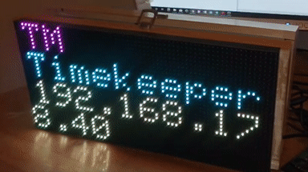
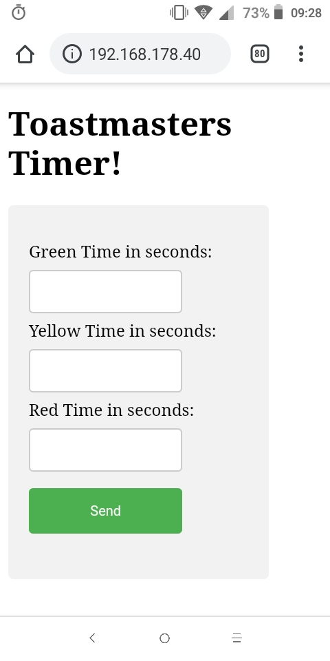
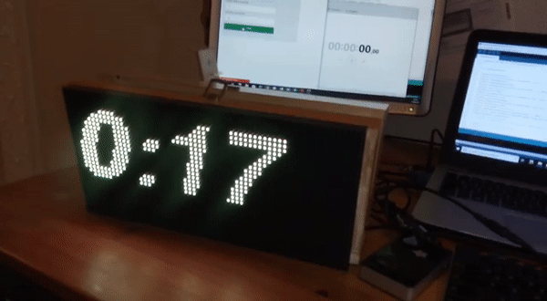

# ToastmastersTimerWiFi
Timer for Toastmasters Speeches using ESP8266 and a 64x32 Led Matrix
- Steps:
  - Turn on device, go to MessageBoard WiFi access point on computer/smartphone to input WiFi SSID and password.
  - Device reboots and shows this screen:
    - 
  - Navigate from the same network to the local IP address shown
    - You will find this screen there:
      - 
  - Input desired time when countup should turn from white to green, from green to yellow, from yellow to red.
    - 
